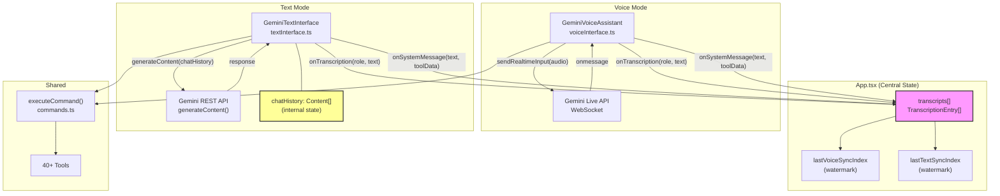
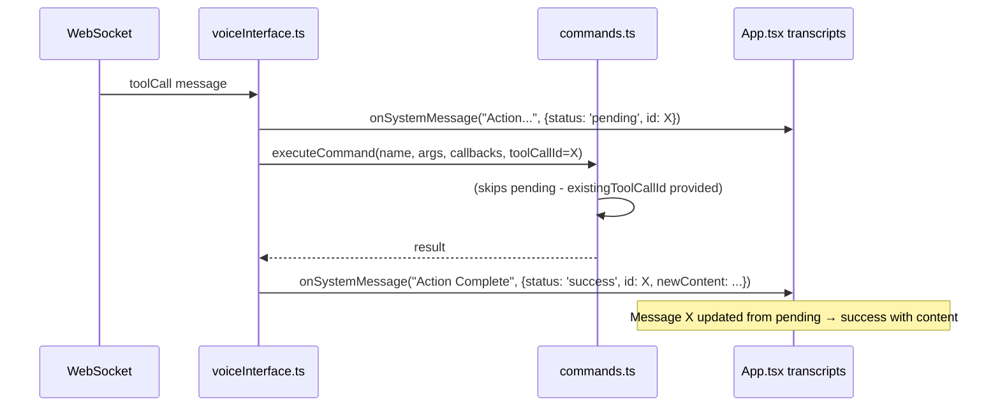
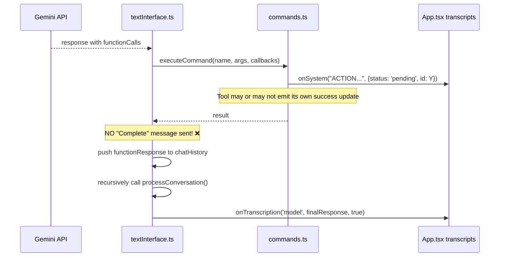
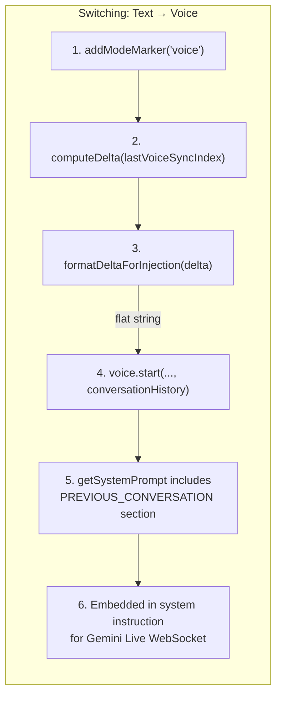
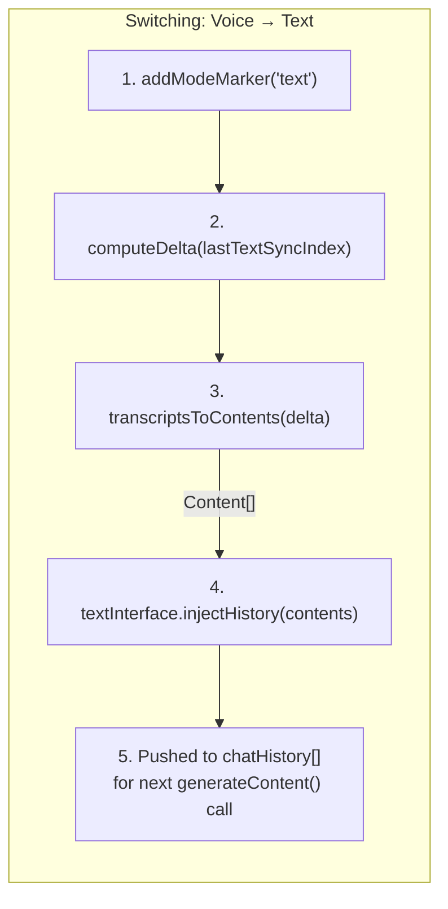
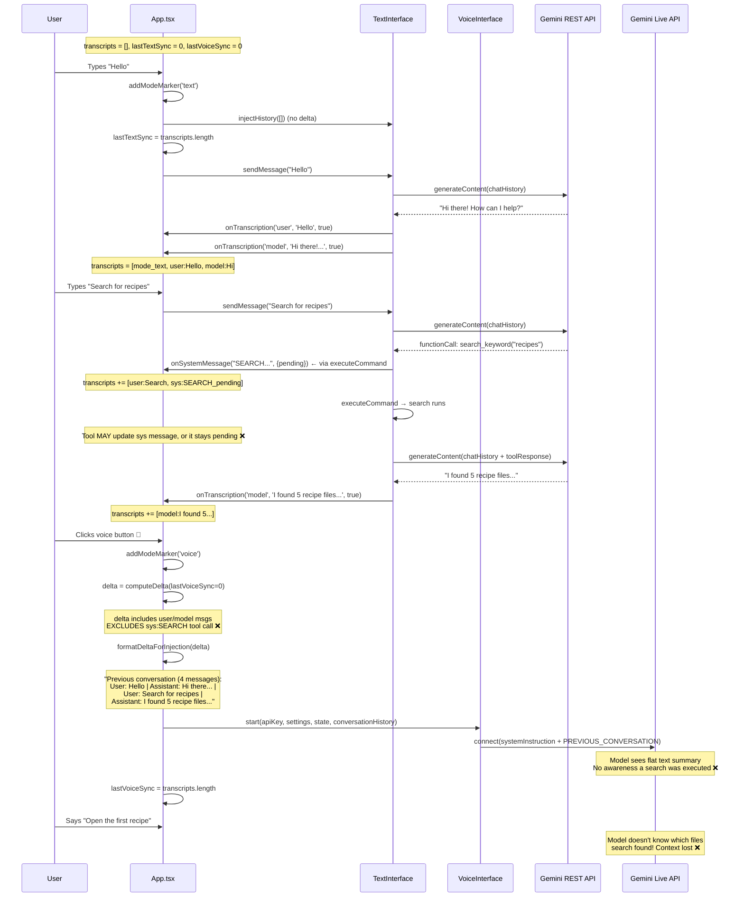
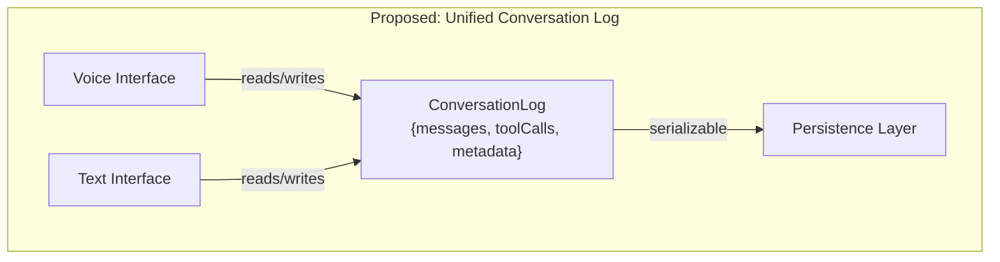

# Text/Voice Interface: Context Sharing & Tool Call Rendering Bugs

## Bug Reports

1. **Text interface not showing tool calls** - Tool executions in text mode don't render visually like they do in voice mode.
2. **Context lost between voice and text** - Switching between voice and text conversations feels like the AI doesn't know about the other mode's history.

---

## Architecture Overview



### Key Insight: Two Separate State Machines

| | Voice Interface | Text Interface |
|---|---|---|
| **LLM State** | WebSocket session (server-side) | `chatHistory: Content[]` (client-side) |
| **API** | `ai.live.connect()` (streaming) | `ai.models.generateContent()` (request/response) |
| **Model** | `gemini-2.5-flash-native-audio-preview` | `gemini-2.0-flash` |
| **History** | Embedded in system prompt as flat text | Proper `Content[]` array with roles |
| **Tool calls** | Model sends via WebSocket, response sent back to session | Model returns in response, response added to chatHistory |

---

## Bug 1: Text Interface Not Showing Tool Calls

### Root Cause

The voice and text interfaces handle tool call UI updates **differently** after `executeCommand()` returns.

#### Voice Interface Flow (works correctly)



**Key**: Voice interface creates the pending message itself, passes the ID to `executeCommand`, and after execution creates the "Complete" update with display content (lines 474-535 of `voiceInterface.ts`).

#### Text Interface Flow (bug)



**Key**: The text interface does NOT pass an `existingToolCallId`, so `executeCommand` creates its own pending message. After `executeCommand` returns, the **text interface never sends a completion update**. The voice interface has 60 lines of post-execution UI update code (lines 474-535) that the text interface lacks entirely.

### Impact

- Tools that emit their own `onSystem` success callback (e.g., `search_keyword`, `list_directory`) show up correctly in both modes.
- Tools that DON'T emit their own success callback (e.g., `create_file`, `read_file`, `edit_file`, `move_file`) appear as eternally "pending" in text mode, but show "Complete" in voice mode.
- The pending pill is visually minimal (just an "ACTION..." label with spinner), so users may not notice tool calls happened at all.

### Affected Files

- `services/textInterface.ts` lines 128-188 (missing post-execution UI update)
- `services/voiceInterface.ts` lines 474-535 (has the correct post-execution update)

### Fix Proposal

Add post-execution completion handling in `textInterface.ts`, mirroring the voice interface's pattern:

```typescript
// In textInterface.ts processConversation(), after executeCommand returns:
for (const part of functionCalls) {
  const fc = part.functionCall;
  const toolCallId = `tool-${Date.now()}-${Math.random().toString(36).slice(2, 7)}`;

  // 1. Create pending message BEFORE calling executeCommand
  this.callbacks.onSystemMessage(`${actionName}...`, {
    id: toolCallId,
    name: fc.name,
    filename: filenameLabel,
    status: 'pending'
  });

  try {
    let toolUpdatedMessage = false;
    const result = await executeCommand(fc.name, fc.args, {
      ...callbacks,
      onSystem: (t, d) => {
        this.callbacks.onSystemMessage(t, d);
        if (d?.status === 'success') toolUpdatedMessage = true;
      }
    }, toolCallId, this.currentFolder);  // Pass toolCallId!

    // 2. Send completion update if tool didn't already
    if (!toolUpdatedMessage) {
      this.callbacks.onSystemMessage(`${actionName} Complete`, {
        id: toolCallId,
        name: fc.name,
        filename: filenameLabel,
        status: 'success',
        newContent: extractDisplayContent(fc.name, fc.args, result)
      });
    }
    // ... rest of function response handling
  }
}
```

Extract the display content logic from `voiceInterface.ts` lines 476-506 into a shared utility function used by both interfaces.

---

## Bug 2: Context Not Shared Between Voice and Text

### Context Sync Flow





### Issues Found

#### Issue 2a: Text → Voice - History Compressed to Flat String

**Location**: `App.tsx` lines 221-233, `formatDeltaForInjection()`

```typescript
const formatDeltaForInjection = (delta: TranscriptionEntry[]): string => {
    const messages = delta.map(t => {
      const role = t.role === 'user' ? 'User' : t.role === 'model' ? 'Assistant' : 'System';
      const cleanText = t.text.replace(/[\n\r\t]/g, ' ').replace(/[^\w\s.,!?;:'"-]/g, '');
      return `${role}: ${cleanText}`;
    });
    return `Previous conversation (${delta.length} messages): ${messages.join(' | ')}`;
};
```

Problems:
- **Aggressive sanitization**: `replace(/[^\w\s.,!?;:'"-]/g, '')` strips markdown, code, URLs, special characters
- **Flat string format**: All messages concatenated with `|` separator, losing conversation structure
- **Embedded in system prompt**: Added as `PREVIOUS_CONVERSATION:` section in the system instruction (`getSystemPrompt.ts` line 55). The model may not properly distinguish prior conversation from instructions.
- **No tool call context**: Tool calls are stripped by `computeDelta` filter (system messages excluded)

#### Issue 2b: Voice → Text - Only User/Model Messages Preserved

**Location**: `App.tsx` lines 235-242, `transcriptsToContents()`

```typescript
const transcriptsToContents = (transcripts: TranscriptionEntry[]): Content[] => {
    return transcripts
      .filter(t => t.role === 'user' || t.role === 'model')
      .map(t => ({
        role: t.role as 'user' | 'model',
        parts: [{ text: t.text }]
      }));
};
```

Problems:
- **Tool calls stripped**: All system messages (tool executions) are filtered out
- **No tool results in context**: The text API has no knowledge of what tools were called in voice mode
- **Missing function call/response pairs**: The Gemini text API expects `Content[]` with proper `functionCall` and `functionResponse` parts for tool history. Simple text injection doesn't give the model awareness of prior tool use.

#### Issue 2c: computeDelta Filters Out All Tool Context

**Location**: `App.tsx` lines 214-219

```typescript
const computeDelta = (fromIndex: number): TranscriptionEntry[] => {
    return transcriptsRef.current.slice(fromIndex).filter(t =>
      t.role !== 'system' ||
      t.toolData?.name === 'mode_switch'
    );
};
```

This filter includes:
- All `user` and `model` messages (good)
- System messages with `mode_switch` toolData (good)

This filter **excludes**:
- All tool call system messages (search results, file operations, etc.)
- System messages without toolData
- Any context about what the AI did (not just said)

#### Issue 2d: Voice API Limitation - No Mid-Session Context Injection

The Gemini Live API (WebSocket) receives the system instruction once at connection time. There's no mechanism to inject additional conversation context after the session starts. This means:

- If a user has a text conversation, starts voice, has a voice conversation, then the voice model has the text context.
- But if the user switches back to text, then back to voice AGAIN, the voice model gets a NEW system prompt with the latest delta. However, it LOSES all context from the previous voice session (since that's now in the server-side WebSocket state that was closed).

### Detailed Flow Diagram: Full Mode Switch Lifecycle



### Fix Proposal

#### Short-term: Improve Delta Injection Quality

1. **Include tool summaries in delta**: Modify `computeDelta` to include system messages that have meaningful toolData (not just mode_switch):

```typescript
const computeDelta = (fromIndex: number): TranscriptionEntry[] => {
    return transcriptsRef.current.slice(fromIndex).filter(t =>
      t.role === 'user' || t.role === 'model' ||
      (t.role === 'system' && t.toolData?.name === 'mode_switch') ||
      (t.role === 'system' && t.toolData?.status === 'success' && t.toolData?.newContent)
    );
};
```

2. **Better voice history formatting**: Replace `formatDeltaForInjection` with a richer format that preserves structure:

```typescript
const formatDeltaForInjection = (delta: TranscriptionEntry[]): string => {
    const messages = delta.map(t => {
      if (t.role === 'system' && t.toolData) {
        return `[Tool: ${t.toolData.name}] ${t.toolData.newContent || t.text}`;
      }
      const role = t.role === 'user' ? 'User' : 'Assistant';
      return `${role}: ${t.text}`;
    });
    return `PREVIOUS_CONVERSATION:\n${messages.join('\n\n')}`;
};
```

3. **Include tool context in text injection**: Modify `transcriptsToContents` to include tool execution summaries as model messages:

```typescript
const transcriptsToContents = (transcripts: TranscriptionEntry[]): Content[] => {
    const contents: Content[] = [];
    for (const t of transcripts) {
      if (t.role === 'user' || t.role === 'model') {
        contents.push({ role: t.role, parts: [{ text: t.text }] });
      } else if (t.role === 'system' && t.toolData?.status === 'success' && t.toolData?.newContent) {
        // Include successful tool results as model context
        contents.push({
          role: 'model',
          parts: [{ text: `[Executed ${t.toolData.name}: ${t.toolData.newContent}]` }]
        });
      }
    }
    return contents;
};
```

#### Medium-term: Unified Conversation State

Create a shared conversation log that both interfaces read from/write to:



This would:
- Store conversation entries in a normalized format (user messages, model messages, tool calls with results)
- Allow both interfaces to read the full history when initializing
- Enable proper tool call context transfer between modes
- Decouple UI rendering from API-specific formats

---

## Summary of Changes Needed

| Priority | Issue | File(s) | Effort |
|----------|-------|---------|--------|
| **P0** | Text tool calls not showing completion | `textInterface.ts` | Small - add post-execution UI update |
| **P0** | Extract shared display content logic | New: `utils/toolDisplay.ts` | Small - extract from voiceInterface.ts |
| **P1** | Tool context stripped from deltas | `App.tsx` computeDelta | Small - widen filter |
| **P1** | Lossy voice history format | `App.tsx` formatDeltaForInjection | Small - improve format |
| **P1** | Tool context not in text injection | `App.tsx` transcriptsToContents | Small - include tool summaries |
| **P2** | Unified conversation state | Multiple files | Large - architectural change |
